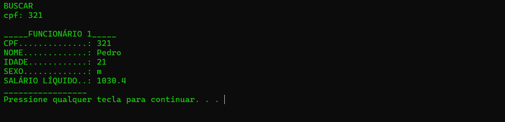
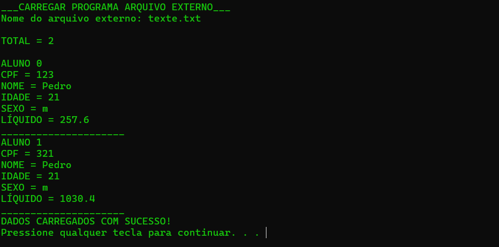

# 💼 Sistema de Cadastro de Funcionários em C++

> Este projeto é um sistema em C++ para **cadastro, consulta e exibição de dados de funcionários**, incluindo o cálculo automático do **salário líquido com desconto do INSS**, com base em faixas salariais reais. O sistema também permite **salvar e carregar dados de arquivos externos**.
---

## 📋 Funcionalidades

🔢 Cadastro de até 50 funcionários  
🧾 Verificação de CPF duplicado  
🧮 Cálculo automático do salário líquido com base nas horas e valor por hora  
💸 Desconto do INSS aplicado conforme a faixa salarial  
📊 Exibição de funcionários por faixa de salário  
🔍 Consulta de funcionário por CPF  
📋 Exibição de todos os funcionários cadastrados  
💾 Salvamento dos dados em arquivo .txt  
📂 Carregamento automático de dados salvos anteriormente  

---

## 🧾 Cálculo do INSS (Base 2024)

| Faixa Salarial (R$)         | Alíquota INSS |
|-----------------------------|---------------|
| Até 1.751,81                | 8%            |
| 1.751,82 até 2.919,72       | 9%            |
| 2.919,73 até 5.839,45       | 11%           |
| Acima de 5.839,45           | Sem desconto adicional (teto aplicado) |

---

## 📸 Preview do sistema
> Interface de fácil iteração e com opções navegáveis:

## 🪪 Adicionar funcionário

## 🔎 Buscar funcionário

## 💾 Carregar arquivo `.txt`

---

## 📂 Como Usar

1. Compile o código com um compilador C++.
2. Execute o `.exe` gerado.
3. Crie sua conta e comece a usar!.

---

## 💡 Tecnologias Utilizadas

- C++(Dev-c++)
- Terminal: Git Bash
- Design modular com separação por funções

---

## 📌 Observações

- Este projeto é de uso acadêmico e pessoal.
- Sinta-se à vontade para contribuir ou adaptar ao seu cenário.

---

## 📝 Licença

Este projeto está sob a licença MIT.  